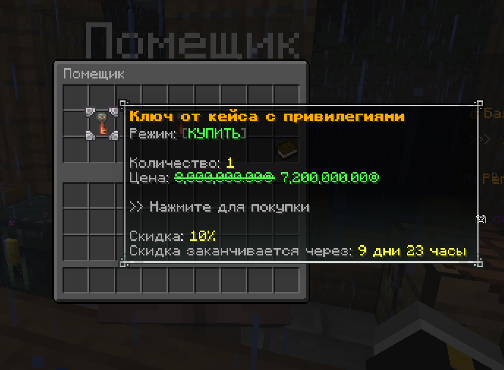

# Кейсы

**Кейсы** — это один из способов получить бесплатные или эксклюзивные привилегии на нашем проекте. Они дают игрокам возможность получить уникальные предметы, бонусы или особые возможности, делая игровой процесс более интересным и разнообразным. Кейсы могут содержать разные награды: от косметических предметов до временных или постоянных привилегий.

### Как получить ключи?

Ключи — это специальные предметы, которые позволяют открыть кейсы и получить награды. Существует несколько способов их получения:

Покупка у Помещика В игре вы можете приобрести ключи у персонажа Помещик. Это быстрый способ получить нужное количество ключей без ожидания и участия в событиях.

Выигрыш на ивентах Мы регулярно проводим игровые события и конкурсы, где ключи раздаются в качестве наград. Участие в ивентах не требует затрат, а шансы на выигрыш зависят от вашей активности и удачи.

Покупка на официальном сайте Ключи можно купить через наш сайт. При этом стоит учитывать, что на сайте доступны только ключи с донатом.
`https://boosty.to/yurosing`
::: warning ВНИМАНИЕ На сайте вы можете купить только ключ с донатом. :::

### Как использовать/применять ключи?

Чтобы использовать ключ, откройте инвентарь и выберите кейс, который хотите открыть. Затем примените ключ на выбранный кейс, после чего вы получите награду. Обратите внимание, что каждый ключ можно использовать только один раз. Кейсы могут содержать разные награды, и их содержимое определяется случайным образом. Следите за новыми ивентами и обновлениями, чтобы не пропустить шанс получить редкие и эксклюзивные предметы.